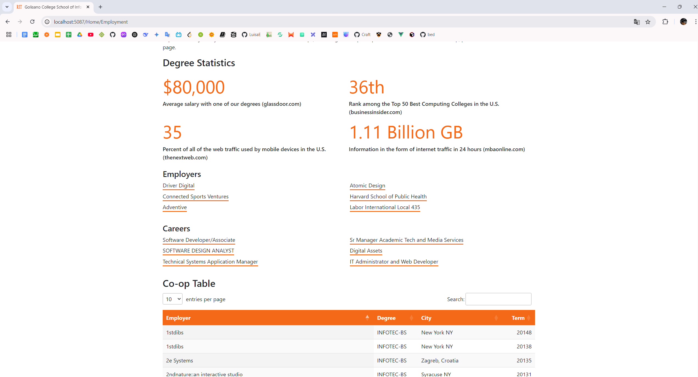

# RIT iSchool Website Remake

 <!-- Add a screenshot if available -->
 <!-- Add a screenshot if available -->
 <!-- Add a screenshot if available -->
 <!-- Add a screenshot if available -->
 <!-- Add a screenshot if available -->
 <!-- Add a screenshot if available -->
 <!-- Add a screenshot if available -->

## Overview
A dynamic front-end web application that consumes and displays official RIT data from RESTful APIs, built using C# Model-View-Controller (MVC) architecture.

## Features
- **API Data Consumption**: Fetches and renders data from multiple endpoints including:
  - About
  - Degrees
  - Minors
  - Employment
  - People
  - Courses
- **Asynchronous Data Loading**: Uses `HttpClient` for efficient API calls
- **Interactive UI Components**: Enhanced with jQuery UI and plugins:
  - [DataTables](https://datatables.net/) for advanced table functionality
  - [jQueryUI](https://jqueryui.com/accordion/) for improved accordion elements
  - [Bootstrap Modal](https://getbootstrap.com/docs/4.0/components/modal/) for dialog boxes
- **Special Features**:
  - Minimalist, clean design
  - Expando object implementation in Degrees/Minors sections
  - Clickable courses in Minors section with API request caching
  - Engaging splash page?
  - Dynamic footer that fetches from the footer endpoint

## Technologies Used
- C# MVC
- ASP.NET Core
- jQuery
- jQuery UI
- Bootstrap
- RESTful API consumption

### Prerequisites
- .NET Core SDK
- Visual Studio (recommended) or VS Code